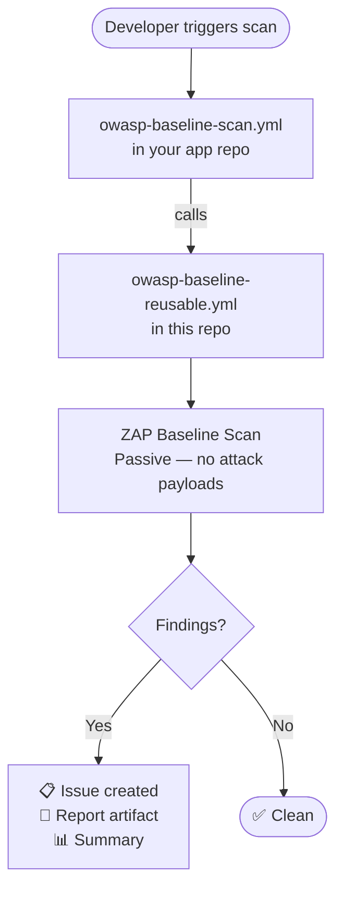
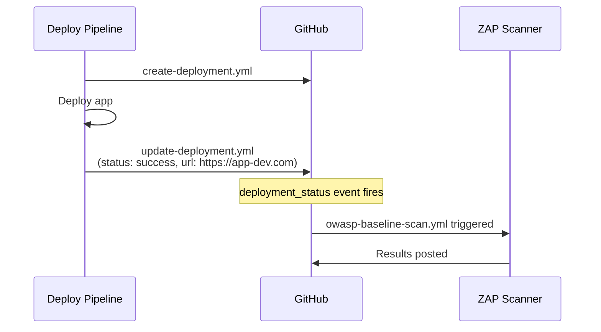

# github-owasp-templates

[](LICENSE)
[](https://github.com/ComputerNiagara/github-owasp-templates/stargazers)
[](https://github.com/ComputerNiagara/github-owasp-templates/network)

> **⚠️ Proof of Concept**
> This repo is a work in progress and has not yet been fully tested.
> Workflows may change between versions including breaking changes before v1.0.0 is stable.
> Use at your own risk. Contributions and feedback welcome — see [CONTRIBUTING.md](CONTRIBUTING.md).

Reusable GitHub Actions workflows for automated OWASP security scanning. Drop into any repo in minutes — no OWASP expertise required.

**What's included:**
- 🔍 **ZAP Baseline Scan** — passive DAST, safe for any environment, fires automatically after deployments
- ⚠️ **ZAP Full Scan** — active DAST with real attack payloads, approval gated
- ⚠️ **ZAP API Scan** — active API DAST using your OpenAPI spec, approval gated
- 🚀 **Deployment integration** — reusable workflows to wire up automatic scan triggering

---

## Quick Start

**Under 5 minutes to your first scan.**

### Step 1 — Add the baseline scan to your repo

Create `.github/workflows/owasp-baseline-scan.yml`:

```yaml
name: OWASP Baseline Scan

on:
  workflow_dispatch:
    inputs:
      target_url:
        description: 'URL to scan'
        required: true
        type: string
        default: 'http://testphp.vulnweb.com'
      environment:
        description: 'Environment'
        required: true
        type: choice
        options: [dev, staging, uat]

jobs:
  scan:
    uses: ComputerNiagara/github-owasp-templates/.github/workflows/owasp-baseline-reusable.yml@v1
    with:
      target_url: ${{ github.event.inputs.target_url }}
      environment: ${{ github.event.inputs.environment }}
```

### Step 2 — Run it

Go to your repo → **Actions → OWASP Baseline Scan → Run workflow**

Enter a URL (or leave the default test URL) and hit Run.

### Step 3 — See results

- 📋 **Issues tab** — findings listed as a GitHub Issue
- 📁 **Artifacts** — full ZAP HTML report
- 📊 **Workflow summary** — pass/fail per scan

That's it.

---

## How It Works



All scan logic lives in this repo. Your app repo just calls it — no scan YAML to maintain.

Works with both **GitHub Actions** and **Azure DevOps** deploy pipelines.

---

## Automatic Scanning After Deployment

The real power of this setup is scanning automatically whenever your app deploys. No manual triggers, no forgetting to run the scan.



See the [deploy-integration example](examples/deploy-integration/) for the full setup.

---

## Workflows

> **Runner OS requirement:** ZAP runs as a Docker container — only Linux runners
> are supported. GitHub-hosted `ubuntu-latest` works out of the box.
> `windows-latest` and `macos-latest` do not have Docker and will fail.
> Self-hosted runners must be Linux with Docker installed.

### `owasp-baseline-reusable.yml`

Passive DAST scan using ZAP Baseline. Safe for all environments. No attack payloads sent.

| Input | Required | Default | Description |
|-------|----------|---------|-------------|
| `target_url` | ✅ | — | URL of the app to scan |
| `environment` | ✅ | `dev` | Environment label |
| `runner` | ❌ | `ubuntu-latest` | Runner label — must be Linux. Use `ubuntu-latest` for public apps or a self-hosted Linux runner label for internal apps. Windows and macOS are not supported. |
| `fail_on_warn` | ❌ | `false` | Fail on ZAP warnings |

| Secret | Required | Description |
|--------|----------|-------------|
| `ZAP_AUTH_HEADER_VALUE` | ❌ | Bearer token for authenticated scanning |

---

### `owasp-active-reusable.yml`

⚠️ Active DAST — sends real attack payloads. Requires approval gate. Isolated environments only.

| Input | Required | Default | Description |
|-------|----------|---------|-------------|
| `scan_type` | ✅ | `full-scan` | `full-scan` (web app), `api-scan` (REST/GraphQL), or `both` |
| `target_url` | ✅ | — | Isolated environment URL only — never DEV/UAT/prod |
| `openapi_spec_url` | ❌ | — | URL to OpenAPI/Swagger spec — required for `api-scan` or `both` |
| `environment` | ✅ | `scan-isolated` | Environment label for this scan run |
| `runner` | ❌ | `ubuntu-latest` | Runner label — must be Linux. Windows and macOS are not supported. |
| `fail_on_warn` | ❌ | `true` | Fail on ZAP warnings |

**Requires a `security-approved` GitHub Environment with required reviewers configured.**
See [Active Scan Setup](#active-scan-setup).

---

### `create-deployment.yml` + `update-deployment.yml`

Creates and updates GitHub Deployment records to trigger automatic ZAP scanning
after deployments. Works with both GitHub Actions and Azure DevOps pipelines.

| Input | Required | Description |
|-------|----------|-------------|
| `environment` | ✅ | Environment name — must match ZAP filter (`dev`, `staging`, `uat`) |
| `deployment_id` | ✅ (update only) | ID returned by `create-deployment.yml` |
| `status` | ✅ (update only) | `success` or `failure` |
| `environment_url` | ❌ (update only) | Live app URL — **required for ZAP to scan** |

---

## Examples

| Example | What it shows |
|---------|--------------|
| [basic-web-app](examples/basic-web-app/) | Simplest setup — baseline scan, manual + auto trigger |
| [api-app](examples/api-app/) | Web app with API — baseline + active scan |
| [deploy-integration](examples/deploy-integration/) | GitHub Actions deploy pipeline wired up for automatic scanning |
| [ado-integration](examples/ado-integration/) | Azure DevOps pipeline wired up for automatic scanning |

---

## Scan Comparison

| | ZAP Baseline | ZAP Full Scan | ZAP API Scan |
|---|---|---|---|
| Sends attack payloads | ❌ Never | ✅ Yes | ✅ Yes |
| Safe for shared environments | ✅ Yes | ❌ No | ❌ No |
| API endpoint coverage | ⚠️ Linked only | ⚠️ Linked only | ✅ Full via spec |
| Requires approval gate | ❌ | ✅ | ✅ |
| Typical run time | 5–10 min | 30–60 min | 30–90 min |

---

## Using This Repo

### Public / internet-accessible apps

Reference the workflows directly — no fork needed:

```yaml
uses: ComputerNiagara/github-owasp-templates/.github/workflows/owasp-baseline-reusable.yml@v1
with:
  target_url: 'https://your-public-app.com'
  environment: dev
  runner: 'ubuntu-latest'
```

GitHub-hosted runners (`ubuntu-latest`) handle everything. No setup required on your end.

---

### Internal / intranet apps

Self-hosted runners must be registered in the same account or org as the workflow repo.
This means you need to **fork this repo** into your org first, then reference your fork.

**1. Fork this repo**
```
github.com/ComputerNiagara/github-owasp-templates → Fork → your-org/github-owasp-templates
```

**2. Register your self-hosted runner against your fork**
```
your-org/github-owasp-templates → Settings → Actions → Runners → New self-hosted runner
```
The runner needs:
- Docker installed — ZAP runs as a container
- Network access to your internal app URL
- Outbound access to `ghcr.io` to pull the ZAP image

**3. Reference your fork in your workflows**
```yaml
uses: YOUR-ORG/github-owasp-templates/.github/workflows/owasp-baseline-reusable.yml@v1
with:
  target_url: 'https://internal-app.yourcompany.com'
  environment: dev
  runner: 'self-hosted'   # or your custom runner label
```

**4. Stay up to date**
Sync your fork from upstream when new versions are released, then cut your own version tag.

---

## Authenticated Scanning

If your app requires a Bearer token to access:

1. Add a repo secret named `ZAP_AUTH_HEADER_VALUE`
2. Uncomment the `cmd_options` block in `owasp-baseline-reusable.yml`

---

## Active Scan Setup

Before using the active scan:

1. Create a `security-approved` environment in your repo:
   ```
   Repo → Settings → Environments → New environment → security-approved
   → Required reviewers → add your security reviewer
   ```

2. Add `owasp-active-scan.yml` to your repo (see [api-app example](examples/api-app/))

3. The workflow will pause for approval before sending any attack payloads

---

## Versioning

This repo uses semantic versioning. Reference a specific version in your workflows:

```yaml
uses: ComputerNiagara/github-owasp-templates/.github/workflows/owasp-baseline-reusable.yml@v1
```

| Tag | Status | Notes |
|-----|--------|-------|
| `@v1` | ⚠️ Beta | Work in progress — not production tested |
| `@main` | 🚧 Development | May include breaking changes |

Pin to `@v1` in production. Use `@main` only for testing.

---

## Contributing

Contributions welcome. See [CONTRIBUTING.md](CONTRIBUTING.md).

Planned features and enhancements — see [ROADMAP.md](ROADMAP.md).

---

## License

MIT — see [LICENSE](LICENSE).
