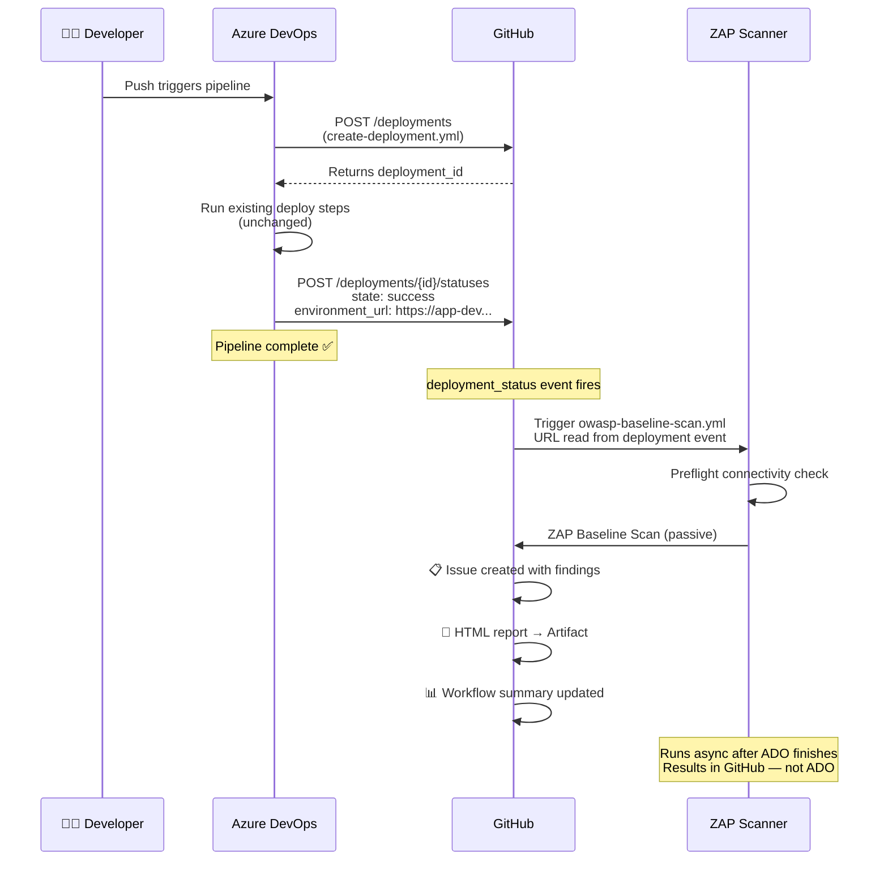

# ADO Integration

Integrate your Azure DevOps pipelines with the OWASP ZAP baseline scan so that
security scanning fires automatically after every successful deployment —
without changing your existing deploy steps.

---

## Important — Understand This Before You Start

**ADO and GitHub are two separate systems.** This integration connects them
through the GitHub Deployments API. Before setting anything up, understand
exactly what each system does and where results end up.

### What ADO does
- Runs your deployment pipeline as normal
- Calls the GitHub REST API at the start of the deploy to register a deployment record
- Calls the GitHub REST API at the end to report success or failure
- That's it — ADO is done

### What GitHub does
- Receives the deployment status from ADO
- Fires a `deployment_status` event inside your GitHub repo
- Triggers `owasp-baseline-scan.yml` automatically
- Runs ZAP against the URL you provided
- Posts results to the GitHub repo

### Where scan results appear

> ⚠️ **Results appear in GitHub — not in ADO.**

Your ADO pipeline will show your deployment steps completing as normal.
The ZAP scan runs separately in GitHub Actions after the deploy completes.
Teams used to checking only ADO for pipeline results need to know to look
in GitHub for security scan results.

| Result | Where to find it |
|--------|-----------------|
| Findings list | GitHub repo → **Issues** tab |
| Full HTML report | GitHub repo → Actions → workflow run → **Artifacts** |
| Scan pass/fail | GitHub repo → **Actions** tab → OWASP Baseline Scan |
| CVE alerts | GitHub repo → **Security** tab → Dependabot |

---

## How It Works — Full Flow



**Key points:**
- ADO does not wait for ZAP to finish — the scan runs asynchronously in GitHub Actions
- ZAP only fires on successful deployments — failed ADO pipelines do not trigger a scan
- Results appear in GitHub, not ADO — see [ROADMAP.md](../../ROADMAP.md) for planned ADO results integration

---

## What Authenticates ADO to Call GitHub

ADO needs a token to call the GitHub Deployments REST API. The token is stored
as a secret in an ADO variable group and injected at pipeline runtime —
it never appears in logs or YAML files.

**Token scope required:** `repo_deployments` only — this is a narrow scope that
allows creating and updating deployment records. It cannot read code, push
commits, or access anything else in your repos.

**Two token options:**

| | GitHub PAT | GitHub App |
|---|---|---|
| Tied to a user account | ✅ Yes — breaks if user leaves | ❌ No — org-owned |
| Setup complexity | Simple | More involved |
| Audit trail | Basic | Full |
| Token rotation | Manual | Automatic |
| Recommended for | Getting started / testing | Production enterprise use |

Start with a PAT to validate the integration, then migrate to a GitHub App
for production.

---

## Repository Structure

The ADO templates live in a **shared ADO templates repo** — separate from any
individual app pipeline. This mirrors the centralized pattern used on the
GitHub side. Update the shared templates once and all pipelines pick it up.

```
your-ado-org/shared-templates          ← central ADO templates repo (you maintain)
└── templates/
    └── github/
        ├── create-deployment.yml      ← step 1: register deployment with GitHub
        └── update-deployment.yml      ← step 2: report success or failure

your-app-pipeline
└── azure-pipelines.yml
      ├── create-deployment.yml call   ← start of deploy job
      ├── your existing deploy steps   ← completely unchanged
      ├── update-deployment.yml call   ← on success
      └── update-deployment.yml call   ← on failure
```

---

## Setup

### Step 1 — Ensure the GitHub repo has ZAP configured

**Do this first.** The GitHub repo needs `owasp-baseline-scan.yml` with the
`deployment_status` trigger before ADO integration will do anything useful.

Without this workflow in GitHub, ADO will successfully report deployments
but nothing will happen — there is no listener for the event.

See the [basic-web-app example](../basic-web-app/) or [SETUP.md](../../SETUP.md).

---

### Step 2 — Create the shared ADO templates repo

In Azure DevOps, create a repo named `shared-templates` (or use an existing one):
```
ADO → Repos → New repository → shared-templates
```

Copy the contents of the `ado-templates/` folder from this project into it:
```
shared-templates/
└── templates/
    └── github/
        ├── create-deployment.yml
        └── update-deployment.yml
```

Commit to `main`.

---

### Step 3 — Create a GitHub token

**Option A — GitHub Fine-Grained PAT (quickest to set up)**
```
GitHub → Settings → Developer settings
→ Personal access tokens → Fine-grained tokens → Generate new token
→ Repository access: select your app repo (or all repos in your org)
→ Permissions → Repository permissions → Deployments → Read and write
→ Generate token → copy the value immediately
```

**Option B — GitHub App (recommended for enterprise)**

See GitHub's documentation on creating and installing GitHub Apps.
The App needs `deployments: write` permission on the target repos.

---

### Step 4 — Store the token in ADO

```
ADO → Project Settings → Library → Variable Groups → Add variable group
  Name: github-deployment-secrets
  Variables:
    GITHUB_PAT = <paste your token>   🔒 mark as secret
Save
```

Grant your pipeline access to the variable group:
```
Variable group → Pipeline permissions → + → select your pipeline
```

---

### Step 5 — Add three template calls to your pipeline

Your existing deploy steps are completely unchanged. The templates wrap around them.

```yaml
# azure-pipelines.yml

resources:
  repositories:
    - repository: shared-templates
      type: git
      name: YOUR-ADO-ORG/shared-templates    # TODO: replace with your ADO org
      ref: refs/heads/main

variables:
  - group: github-deployment-secrets
  - name: githubOrg
    value: 'your-github-org'                 # TODO: replace
  - name: githubRepo
    value: 'your-github-repo'                # TODO: replace

jobs:
  - job: Deploy
    steps:

      # -----------------------------------------------------------
      # 1. Register deployment with GitHub at the start
      #    Outputs: $(createDeployment.githubDeploymentId)
      # -----------------------------------------------------------
      - template: templates/github/create-deployment.yml@shared-templates
        parameters:
          githubOrg: $(githubOrg)
          githubRepo: $(githubRepo)
          environment: 'dev'                 # must be dev, ist, or uat
          githubPat: $(GITHUB_PAT)

      # -----------------------------------------------------------
      # Your existing deploy steps — no changes needed
      # -----------------------------------------------------------
      - script: echo "your existing deploy steps here"
        displayName: 'Deploy Application'

      # -----------------------------------------------------------
      # 2. Report success + set the URL ZAP will scan
      #    GitHub fires deployment_status event after this step
      #    ZAP scan starts automatically in GitHub Actions
      # -----------------------------------------------------------
      - template: templates/github/update-deployment.yml@shared-templates
        parameters:
          githubOrg: $(githubOrg)
          githubRepo: $(githubRepo)
          environment: 'dev'
          deploymentId: $(createDeployment.githubDeploymentId)
          status: success
          environmentUrl: 'https://your-app-dev.yourcompany.com'  # TODO: replace
          githubPat: $(GITHUB_PAT)
        condition: succeeded()

      # -----------------------------------------------------------
      # 3. Report failure — ZAP will NOT fire on failure
      # -----------------------------------------------------------
      - template: templates/github/update-deployment.yml@shared-templates
        parameters:
          githubOrg: $(githubOrg)
          githubRepo: $(githubRepo)
          environment: 'dev'
          deploymentId: $(createDeployment.githubDeploymentId)
          status: failure
          githubPat: $(GITHUB_PAT)
        condition: failed()
```

See [azure-pipelines.yml](azure-pipelines.yml) for the complete example file.

---

### Step 6 — Run a deployment and verify

1. Trigger your ADO pipeline
2. Confirm all three template steps appear and complete in ADO
3. Go to your **GitHub repo → Actions tab**
4. You should see **OWASP Baseline Scan** triggered and running
5. Wait ~5–10 minutes for it to complete
6. Check **GitHub repo → Issues** for findings
7. Check workflow run → **Artifacts** for the full HTML report

> If the ZAP scan does not appear in GitHub Actions after ADO completes,
> see Troubleshooting below.

---

## Parameters Reference

### `create-deployment.yml`

| Parameter | Required | Default | Description |
|-----------|----------|---------|-------------|
| `githubOrg` | ✅ | — | GitHub org or username |
| `githubRepo` | ✅ | — | GitHub repo name (exact, case-sensitive) |
| `environment` | ✅ | — | Must be exactly `dev`, `ist`, or `uat` |
| `githubPat` | ✅ | — | Token with `repo_deployments` scope |
| `gitRef` | ❌ | `$(Build.SourceVersion)` | Commit SHA, branch, or tag |
| `deploymentIdVariable` | ❌ | `githubDeploymentId` | ADO output variable name |

**Output:** `$(createDeployment.githubDeploymentId)` — pass this to `update-deployment.yml`

### `update-deployment.yml`

| Parameter | Required | Description |
|-----------|----------|-------------|
| `githubOrg` | ✅ | GitHub org or username |
| `githubRepo` | ✅ | GitHub repo name (exact, case-sensitive) |
| `environment` | ✅ | Must be exactly `dev`, `ist`, or `uat` |
| `deploymentId` | ✅ | ID from `create-deployment.yml` |
| `status` | ✅ | `success` or `failure` |
| `githubPat` | ✅ | Token with `repo_deployments` scope |
| `environmentUrl` | ❌ | Live app URL — **required for ZAP to trigger** |
| `description` | ❌ | Custom status description shown in GitHub |

---

## Multiple Environments

For pipelines that deploy to multiple environments, call the templates once per
environment. Each environment gets its own deployment record and triggers its
own independent ZAP scan in GitHub.

```yaml
stages:
  - stage: DeployDev
    jobs:
      - job: Deploy
        steps:
          - template: templates/github/create-deployment.yml@shared-templates
            parameters:
              environment: 'dev'
              # ...
          # your deploy steps
          - template: templates/github/update-deployment.yml@shared-templates
            parameters:
              environment: 'dev'
              environmentUrl: 'https://your-app-dev.yourcompany.com'
              status: success
              # ...
            condition: succeeded()

  - stage: DeployIst
    dependsOn: DeployDev
    jobs:
      - job: Deploy
        steps:
          - template: templates/github/create-deployment.yml@shared-templates
            parameters:
              environment: 'ist'
              # ...
          # your deploy steps
          - template: templates/github/update-deployment.yml@shared-templates
            parameters:
              environment: 'ist'
              environmentUrl: 'https://your-app-ist.yourcompany.com'
              status: success
              # ...
            condition: succeeded()
```

---

## Troubleshooting

| Symptom | Likely cause | Fix |
|---------|-------------|-----|
| `Failed to create GitHub Deployment` in ADO | PAT missing, expired, or wrong scope | Verify PAT has `repo_deployments` scope and hasn't expired |
| `DEPLOYMENT_ID = null` in ADO logs | Wrong org or repo name | Check `githubOrg` and `githubRepo` — exact match, case-sensitive |
| ADO completes but no scan appears in GitHub Actions | `owasp-baseline-scan.yml` missing from GitHub repo | Add the baseline scan workflow to the GitHub repo (Setup Step 1) |
| Scan appears in GitHub but skips immediately | `environment` name doesn't match ZAP filter | Must be exactly `dev`, `ist`, or `uat` |
| Scan appears but preflight fails | `environmentUrl` unreachable | Check URL is correct and app is running |
| Warning: `environmentUrl is empty` in ADO logs | `environmentUrl` not set on success step | Add `environmentUrl` pointing to your live app URL |
| Template not found | Wrong `shared-templates` path | Check `name:` matches exactly: `YOUR-ADO-ORG/shared-templates` |
| Variable group not found | Group not linked to pipeline | ADO → Pipeline → Edit → Variables → Link variable group |
| Pipeline cannot access variable group | Pipeline permissions not set | Variable group → Pipeline permissions → add your pipeline |
| ZAP scan fires but finds nothing | App not fully started at scan time | Add a delay or health check before `update-deployment.yml` runs |
